# Cascade 2.0 — CTL Agent: Agentic AI Architecture Diagrams

**Solution:** Asset Clear-To-List (CTL) Determination Agent  
**Focus:** Agentic AI Component Design  
**Aligned to:** Cascade.CTL.AgentSolution (.NET 8) · cascade2_ctl_agent_solution_architecture.md · CTL_Architecture_Readout.md  
**Date:** March 29, 2026

---

## 1. CTL Agent — System Overview

A single evaluation flow: event in, verdict out. Two processes — the Host orchestrates agents via LLM, the MCP Server exposes tools over HTTP/SSE.

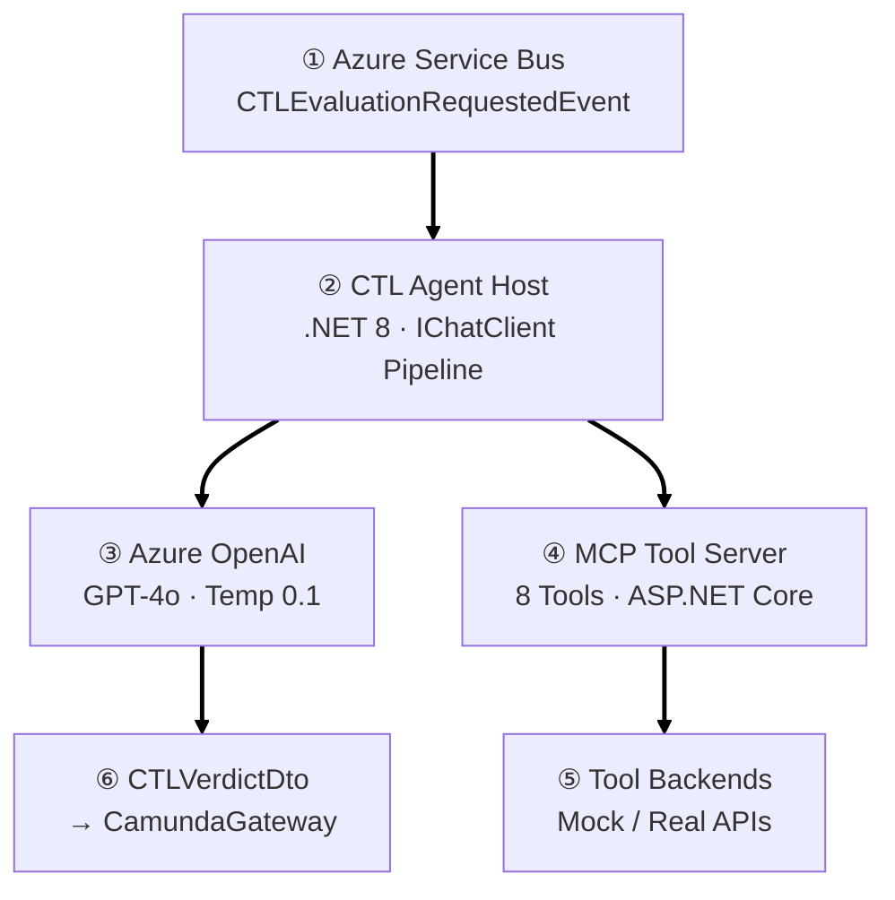

---

## 2. 4-Phase Orchestration Pattern

The core agentic pattern — Plan, Investigate, Reflect, Decide. This is the `CTLEvaluationOrchestrator.EvaluateAsync()` method.

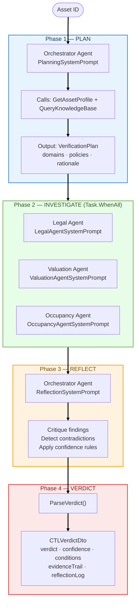

---

## 3. Agent Topology — Who Calls What

Four agents, eight tools. Each agent sees only its assigned tools via `McpToolProvider` role-based filtering. Investigation agents run concurrently and return structured findings to the Orchestrator.

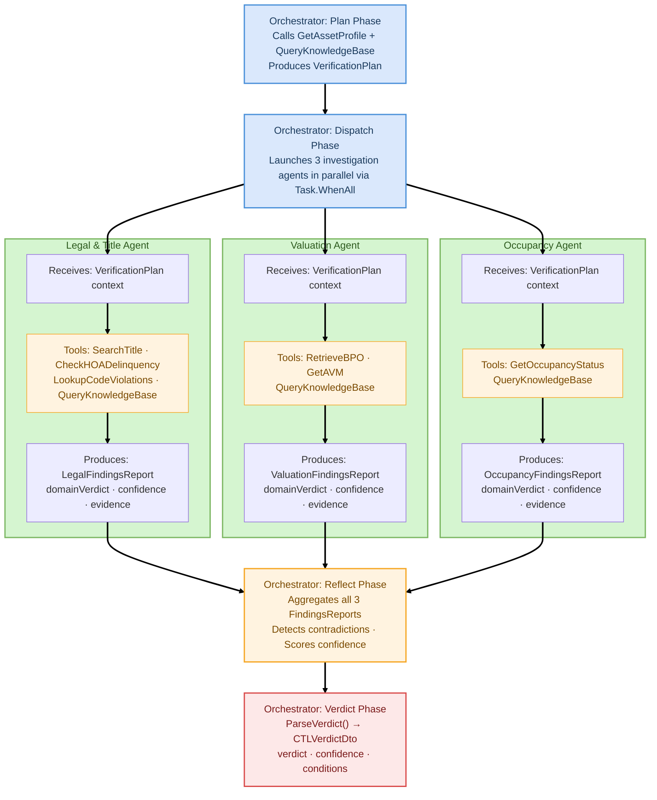

---

## 4. MCP Client-Server Architecture

Two-process model. The Host connects to the MCP Server over HTTP/SSE using `McpClient.CreateAsync()`. Tools are auto-discovered via `[McpServerToolType]` attributes. `McpClientTool` implements `AITool` — direct use with `IChatClient`.

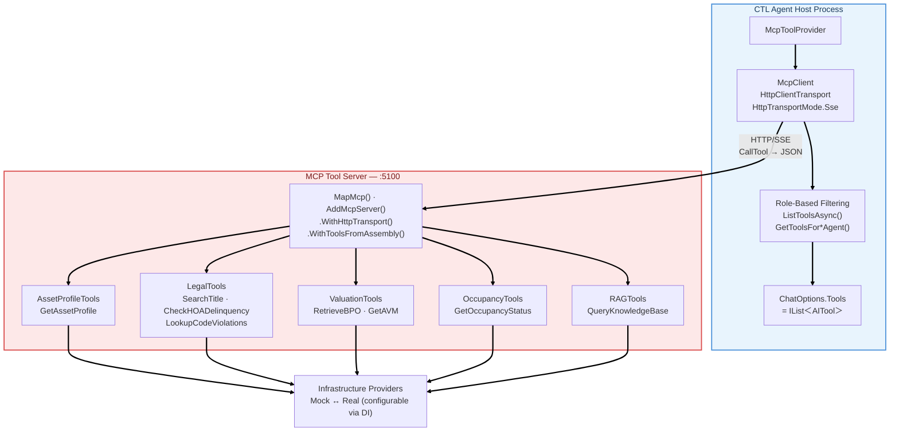

---

## 5. IChatClient Middleware Pipeline

Every LLM call passes through this pipeline. Built in `ServiceRegistration.ConfigureCTLAgent()` via `ChatClientBuilder`. The guardrails wrap the entire pipeline as a `DelegatingChatClient`. This diagram shows the **registration order** (outer to inner). See **Section 5a** below for how it actually executes at runtime, including the tool-calling loop.

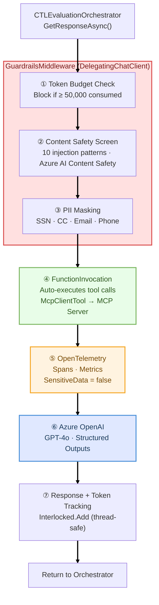

---

## 5a. Middleware Nesting & Tool-Calling Loop — How It Actually Executes

Diagram 5 shows the **registration order** (outer → inner) of the `DelegatingChatClient` chain. At runtime, these layers don't execute top-to-bottom — they wrap each other like nested function calls. Each layer delegates inward on the request path, and processes the response on the way back out. The `FunctionInvocation` layer is critical: it intercepts LLM responses containing `tool_call` requests, executes those tools via MCP, and **re-submits to the LLM** automatically — looping until the model returns a final text response.

This is how `CTLEvaluationOrchestrator` calls `_chatClient.GetResponseAsync()` once, yet the LLM may be invoked multiple times internally (e.g., Plan phase: LLM calls `GetAssetProfile` → tool result fed back → LLM calls `QueryKnowledgeBase` → tool result fed back → LLM returns the VerificationPlan text).

### The LLM Tool-Calling Loop — What Happens Inside `GetResponseAsync()`

`FunctionInvocation` middleware inspects every LLM response for `FunctionCallContent` items (the SDK's deserialization of OpenAI's `tool_calls` JSON array). When found, it executes the matching `AITool` and re-submits the result to the LLM — looping until the response contains only text (no more `FunctionCallContent`).

**The key concept:** Your code calls `GetResponseAsync()` **once**. Inside that single call, the middleware pipeline may invoke the LLM **multiple times** — each time the LLM asks for a tool, the middleware executes it and sends the result back. Your code never sees this loop.


```
 YOUR CODE                    MIDDLEWARE PIPELINE (inside IChatClient)                 CLOUD
 ──────────                   ──────────────────────────────────────                   ─────
 
 Orchestrator                 GuardrailsChatClient    FunctionInvocation    OpenTelemetry    Azure OpenAI
     │                              │                       │                    │              │
     │  GetResponseAsync(           │                       │                    │              │
     │    prompt, tools)            │                       │                    │              │
     │─────────────────────────────>│                       │                    │              │
     │                              │                       │                    │              │
     │                     ① Token budget OK?               │                    │              │
     │                     ② Prompt injection scan          │                    │              │
     │                     ③ PII mask input                 │                    │              │
     │                              │                       │                    │              │
     │                              │  Delegates inward     │                    │              │
     │                              │──────────────────────>│                    │              │
     │                              │                       │                    │              │
     │                              │                       │  Start trace span  │              │
     │                              │                       │───────────────────>│              │
     │                              │                       │                    │  HTTP POST   │
     │                              │                       │                    │  prompt +    │
     │                              │                       │                    │  tool schemas│
     │                              │                       │                    │─────────────>│
     │                              │                       │                    │              │
     │                              │                       │                    │   Response:  │
     │                              │                       │                    │   tool_calls:│
     │                              │                       │                    │   [{name:    │
     │                              │                       │                    │   "GetAsset  │
     │                              │                       │                    │    Profile"}]│
     │                              │                       │                    │<─────────────│
     │                              │                       │  End trace span    │              │
     │                              │                       │<───────────────────│              │
     │                              │                       │                    │              │
     │                              │          ┌────────────────────────┐         │              │
     │                              │          │ LOOP: tool_call found  │         │              │
     │                              │          │                        │         │              │
     │                              │          │ SDK deserializes into  │         │              │
     │                              │          │ FunctionCallContent    │         │              │
     │                              │          │                        │         │              │
     │                              │          │ Finds matching AITool  │         │              │
     │                              │          │ (McpClientTool)        │         │              │
     │                              │          │         │              │         │              │
     │                              │          │         ▼              │         │              │
     │                              │          │  ┌─────────────┐      │         │              │
     │                              │          │  │ MCP Server  │      │         │              │
     │                              │          │  │ :5100       │      │         │              │
     │                              │          │  │ HTTP/SSE    │      │         │              │
     │                              │          │  │ Tool executes│     │         │              │
     │                              │          │  │ Returns JSON │     │         │              │
     │                              │          │  └─────────────┘      │         │              │
     │                              │          │         │              │         │              │
     │                              │          │         ▼              │         │              │
     │                              │          │ Appends tool result    │         │              │
     │                              │          │ to message history     │         │              │
     │                              │          │                        │         │              │
     │                              │          │ Re-submits to LLM ────────────────────────────>│
     │                              │          │                        │         │              │
     │                              │          │ LLM responds with      │         │              │
     │                              │          │ EITHER:                │         │              │
     │                              │          │  • another tool_call   │         │              │
     │                              │          │    → loop again ↑      │         │              │
     │                              │          │  • final text          │         │              │
     │                              │          │    → exit loop ↓       │         │              │
     │                              │          └────────────────────────┘         │              │
     │                              │                       │                    │              │
     │                              │   Final text response │                    │              │
     │                              │<──────────────────────│                    │              │
     │                              │                       │                    │              │
     │                     ⑦ Track token usage              │                    │              │
     │                       PII mask output                │                    │              │
     │                              │                       │                    │              │
     │  ChatResponse (final text)   │                       │                    │              │
     │<─────────────────────────────│                       │                    │              │
     │                              │                       │                    │              │
```

> **1 call from your code → N LLM round-trips handled invisibly by `FunctionInvocation` middleware. Your orchestrator never loops over tool calls.**

### Detailed Mermaid Diagram

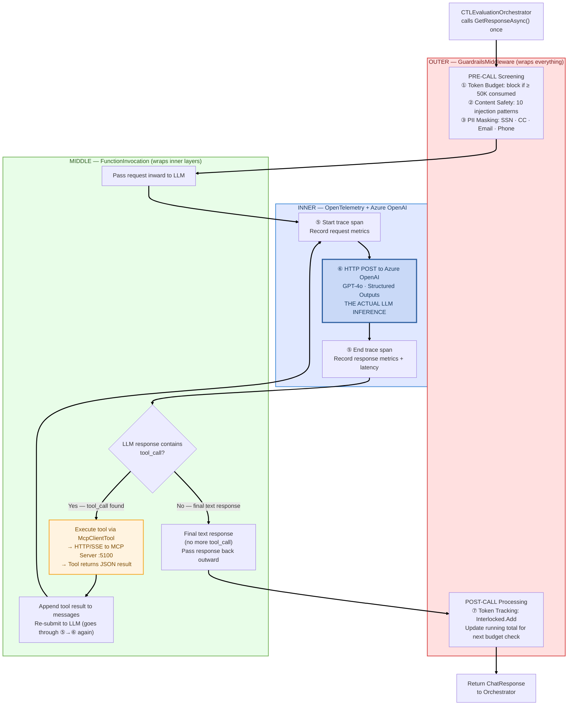

**Concrete example — Plan phase for a Texas foreclosure asset:**

| Loop | What happens | LLM calls |
|------|-------------|-----------|
| **Request 1** | Orchestrator sends PlanningSystemPrompt + asset ID. LLM responds with `tool_call: GetAssetProfile(assetId)` | LLM call #1 |
| **Tool exec** | FunctionInvocation intercepts → McpClientTool → MCP Server → MockAssetProfileProvider returns Asset JSON | — |
| **Request 2** | FunctionInvocation appends tool result to messages, re-submits to LLM. LLM responds with `tool_call: QueryKnowledgeBase(query, state:"TX")` | LLM call #2 |
| **Tool exec** | FunctionInvocation intercepts → McpClientTool → MCP Server → InMemoryRAGService returns CTL-POLICY-TX-001 | — |
| **Request 3** | FunctionInvocation appends tool result, re-submits. LLM returns final text: the VerificationPlan JSON (no more tool_calls) | LLM call #3 |
| **Return** | FunctionInvocation passes text response outward → GuardrailsMiddleware tracks tokens → Orchestrator receives response | — |

> **Key insight:** The Orchestrator calls `GetResponseAsync()` **once** per phase. The `FunctionInvocation` middleware handles multi-turn tool calling transparently — the Orchestrator never manually loops over tool calls.

---

## 6. Reflection & Verdict Decision Logic

The Orchestrator's reflection phase — how contradictions, confidence, and unverified fields determine the final verdict.

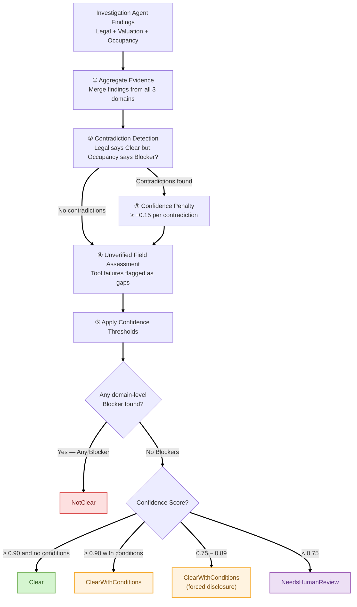

---

## 7. Tool Failure Cascade

Not all tool failures are equal. Blocking tools abort; non-blocking tools reduce confidence.

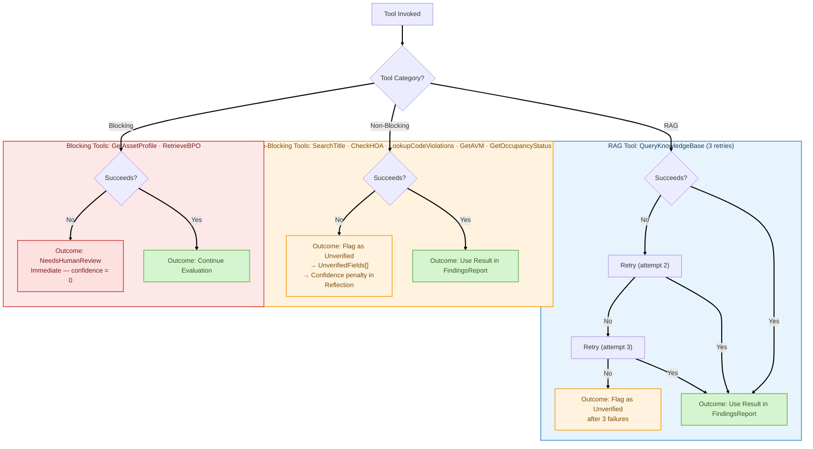

---

## 8. RAG-Grounded Planning — Component Flow

The Planner pattern — how the Orchestrator dynamically builds a verification plan using RAG policy retrieval before dispatching investigation agents. Each step is attributed to the owning component/project in the solution. **Both tool calls (`GetAssetProfile` and `QueryKnowledgeBase`) travel the same path: GPT-4o emits `tool_call` → FunctionInvocation intercepts → McpClientTool → HTTP/SSE → MCP Server → Provider.** There are no direct API calls.

```mermaid
graph TD
    ORCH["① CTLEvaluationOrchestrator<br/>calls GetResponseAsync() once<br/>with PlanningSystemPrompt + asset ID"]

    ORCH --> LLM1["② GPT-4o (LLM call #1)<br/>Reads prompt, decides it needs asset data<br/>Responds: tool_call: GetAssetProfile(assetId)"]

    subgraph TOOLCALL1["Tool Call #1 — GetAssetProfile (same MCP path)"]
        direction TB
        FI1["③a FunctionInvocation intercepts tool_call<br/>→ McpClientTool → HTTP/SSE"]
        MCP1["③b MCP Server :5100<br/>AssetProfileTools.GetAssetProfile()"]
        PROV1["③c IAssetProfileProvider<br/>Returns Asset JSON:<br/>state:TX · type:Foreclosure · county:Dallas · tier:1"]
        FI1 --> MCP1
        MCP1 --> PROV1
    end

    LLM1 --> FI1
    PROV1 --> RET1["③d Result returns through MCP<br/>→ FunctionInvocation appends to conversation"]

    RET1 --> LLM2["④ GPT-4o (LLM call #2)<br/>Reads Asset profile, derives filters<br/>Responds: tool_call: QueryKnowledgeBase<br/>(query, stateCode:'TX', assetType:'Foreclosure')"]

    subgraph TOOLCALL2["Tool Call #2 — QueryKnowledgeBase (same MCP path)"]
        direction TB
        FI2["⑤a FunctionInvocation intercepts tool_call<br/>→ McpClientTool → HTTP/SSE"]
        MCP2["⑤b MCP Server :5100<br/>RAGTools.QueryKnowledgeBase()"]
        subgraph RAG["InMemoryRAGService.QueryAsync()"]
            R1["⑤c Metadata Filter<br/>State · County · AssetType<br/>(exact match or 'ALL' wildcard)"]
            R2["⑤d Keyword Scoring<br/>Title match: +0.3 per term<br/>Content occurrence: +0.1 per hit<br/>Score capped at 1.0"]
            R3["⑤e Relevance Threshold<br/>Exclude docs with score ≤ 0.05"]
            R4["⑤f Top-5 Selection<br/>OrderByDescending(score).Take(5)"]
            R1 --> R2
            R2 --> R3
            R3 --> R4
        end
        FI2 --> MCP2
        MCP2 --> R1
    end

    LLM2 --> FI2
    R4 --> RET2["⑥ RAGQueryResult (JSON)<br/>returns through MCP<br/>→ FunctionInvocation appends to conversation"]

    RET2 --> LLM3["⑦ GPT-4o (LLM call #3)<br/>Now has: Asset profile + policy docs<br/>Synthesizes VerificationPlan JSON<br/>(no more tool_calls → final text response)"]

    LLM3 --> RETURN["⑧ FunctionInvocation passes response outward<br/>→ GuardrailsMiddleware tracks tokens<br/>→ Orchestrator receives VerificationPlan"]

    RETURN --> DISPATCH["⑨ Dispatch Investigation Agents<br/>Each also calls QueryKnowledgeBase<br/>via the same MCP path"]

    style TOOLCALL1 fill:#e8fde8,stroke:#7BB661,stroke-width:2px,color:#2d5a1e
    style TOOLCALL2 fill:#e8fde8,stroke:#7BB661,stroke-width:2px,color:#2d5a1e
    style RAG fill:#ede0f5,stroke:#9B59B6,stroke-width:2px,color:#5b2d82
    style ORCH fill:#dae8fc,stroke:#4A90D9,stroke-width:2px,color:#1a3a5c
    style LLM1 fill:#e0e8ff,stroke:#4A90D9,stroke-width:2px,color:#1a3a5c
    style LLM2 fill:#e0e8ff,stroke:#4A90D9,stroke-width:2px,color:#1a3a5c
    style LLM3 fill:#e0e8ff,stroke:#4A90D9,stroke-width:2px,color:#1a3a5c
    style RET1 fill:#f0f0f0,stroke:#888888,stroke-width:2px,color:#333333
    style RET2 fill:#f0f0f0,stroke:#888888,stroke-width:2px,color:#333333
    style RETURN fill:#fff3e0,stroke:#F5A623,stroke-width:2px,color:#7a4a00
    style DISPATCH fill:#fde8e8,stroke:#D94A4A,stroke-width:2px,color:#7a1a1a
    linkStyle default stroke:#000000,stroke-width:2.5px
```
**Brief Summary of the above flow**

Step ①  Engine(GPT-4o ) receives "evaluate asset ASSET-TX-001"
        Engine says: "I need the asset profile first" → tool_call: GetAssetProfile("ASSET-TX-001")
        
Step ②  Broker (FunctionInvocation) intercepts, calls Asset API, returns JSON:
        { state: "TX", type: "Foreclosure", county: "Dallas", tier: 1 }
        
Step ③  Engine now has context. Says: "TX Foreclosure — I need state-specific policies"
        → tool_call: QueryKnowledgeBase(query: "Texas foreclosure CTL", state: "TX", assetType: "Foreclosure")
        
Step ④  Broker intercepts, calls RAG search API on MCP Server
        
Step ⑤  RAG search (InMemoryRAGService) runs:
        a. Filter: state=TX or ALL → 4 docs remain
        b. Score: keyword match "Texas" +0.3, "foreclosure" +0.3 in title → CTL-POLICY-TX-001 scores 0.9
        c. Threshold: drop anything ≤ 0.05
        d. Return top 5 sorted by score
        
Step ⑥  Policy docs returned through broker back to engine
        
Step ⑦  Engine now has: asset profile + relevant policies
        Synthesizes a work order: "Check Legal (TX §51.002), Valuation (60-day BPO), Occupancy"
        Output: VerificationPlan JSON
        
Step ⑧  Orchestrator takes that plan, fans out 3 parallel service calls
        (each investigation agent is just another engine instance with different config + different API access)


Engine = GPT-4o (Azure OpenAI). It's the LLM — the hosted AI model your solution calls over HTTPS. Your code never runs it locally; it sends text to https://YOUR-RESOURCE.openai.azure.com/ and gets text back. Configured in CTLAgentOptions.AzureOpenAI.Endpoint + DeploymentName: "gpt-4o".

Broker = FunctionInvocation — the built-in Microsoft.Extensions.AI middleware registered via .UseFunctionInvocation() in ServiceRegistration.cs. It sits in the IChatClient pipeline between your orchestrator code and Azure OpenAI. It intercepts tool_call responses from the LLM and routes them to the matching McpClientTool automatically.

The MCP server is created in Program.cs — it calls builder.Services.AddMcpServer() and app.MapMcp() to stand up the MCP endpoint on port 5100.

Decorate custom method with [McpServerTool] to register it as a tool within that MCP server

The tool classes that register onto it are in Tools.

**Component ownership summary:**

| Step | Component / Class | Project | Responsibility |
|------|-------------------|---------|----------------|
| ① Orchestrator call | `CTLEvaluationOrchestrator.GetResponseAsync()` | Application | Single call — FunctionInvocation handles all tool loops internally |
| ② LLM call #1 | GPT-4o (Azure OpenAI) | Cloud service | Reads prompt, emits `tool_call: GetAssetProfile` |
| ③a–d GetAssetProfile | `FunctionInvocation` → `McpClientTool` → MCP Server → `AssetProfileTools` → `IAssetProfileProvider` | Host → McpServer → Infrastructure | **Same MCP path as all tools** — returns Asset JSON |
| ④ LLM call #2 | GPT-4o (Azure OpenAI) | Cloud service | Reads Asset profile, derives filters, emits `tool_call: QueryKnowledgeBase` |
| ⑤a–f QueryKnowledgeBase | `FunctionInvocation` → `McpClientTool` → MCP Server → `RAGTools` → `InMemoryRAGService.QueryAsync()` | Host → McpServer → Infrastructure | **Same MCP path** — metadata filter → keyword scoring → threshold → top-5 |
| ⑥ Result return | MCP protocol → `FunctionInvocation` | Host (pipeline middleware) | RAGQueryResult JSON appended to LLM conversation |
| ⑦ LLM call #3 | GPT-4o (Azure OpenAI) | Cloud service | Synthesizes `VerificationPlan` from Asset + policies (final text, no tool_call) |
| ⑧ Response return | `FunctionInvocation` → `GuardrailsMiddleware` → Orchestrator | Host (pipeline middleware) | Token tracking, then deliver to caller |
| ⑨ Dispatch | `CTLEvaluationOrchestrator` | Application | `Task.WhenAll` dispatches 3 investigation agents with plan context |

> **Key insight:** `QueryKnowledgeBase` is not exclusive to the Plan phase. All 4 agents have it in their tool set (`McpToolProvider.GetToolsFor*()` — see Diagram 3). The Orchestrator calls it during **PLAN** and **REFLECT**, and each investigation agent calls it during **INVESTIGATE** for domain-specific policy lookups. Every tool call — regardless of which tool — travels the identical path: `FunctionInvocation → McpClientTool → HTTP/SSE → MCP Server → Tool Class → Provider`.

**Policy Corpus (InMemoryRAGService — 6 built-in documents, extensible via `/config/rag-knowledge/*.json`):**

| ID | Scope | Coverage |
|----|-------|----------|
| CTL-POLICY-001 | All States | Baseline CTL requirements — title, BPO staleness, occupancy, confidence thresholds |
| CTL-POLICY-TX-001 | Texas Foreclosure | Property Code §51.002, no redemption, HOA Ch. 209, 60-day BPO |
| CTL-POLICY-CA-001 | California REO | Civil Code §2924, 1-year redemption, SB-1079, LA RSO, NHD |
| CTL-POLICY-HOA-001 | All States | HOA delinquency — $5k blocker, $1-5k conditional, super lien states |
| CTL-POLICY-VAL-001 | All States | BPO mandatory, staleness thresholds, AVM variance by state |
| CTL-POLICY-OCC-001 | All States | Occupancy clearance — vacant, eviction, unknown, cash-for-keys |

---

## 9. End-to-End Evaluation — Numbered Steps

The complete evaluation lifecycle from event trigger to verdict delivery, with numbered steps matching the implementation.

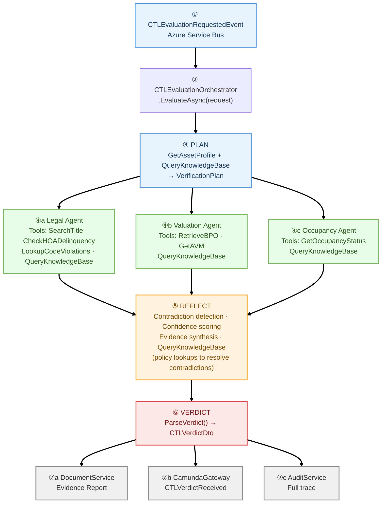

---

## 10. Solution Project Map

How the .NET solution projects map to the agentic architecture layers.

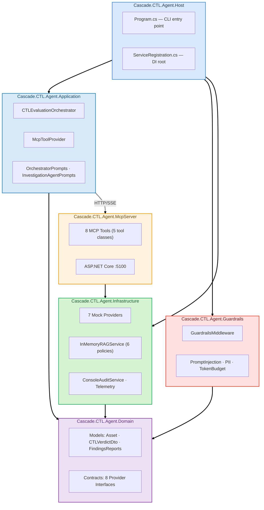

---

