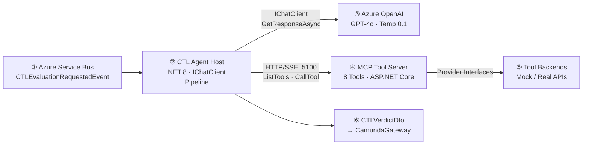
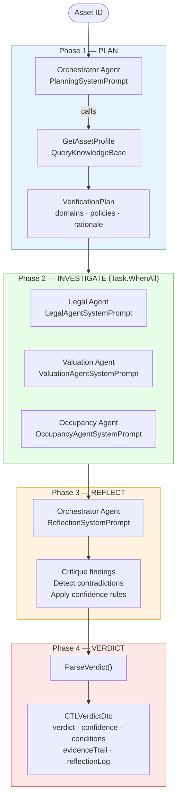
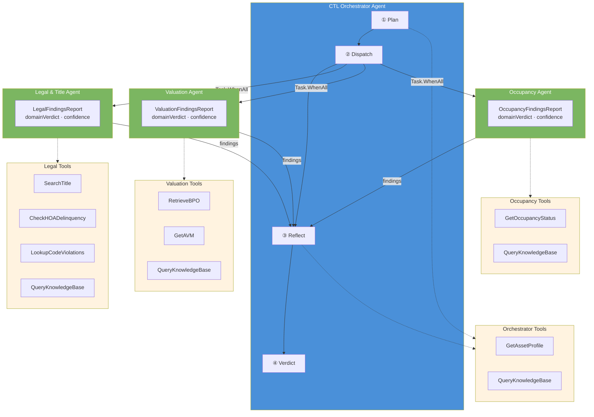
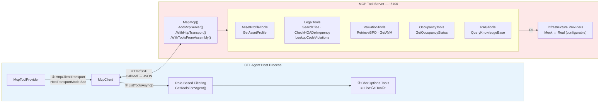
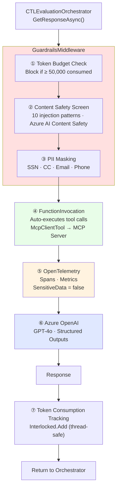
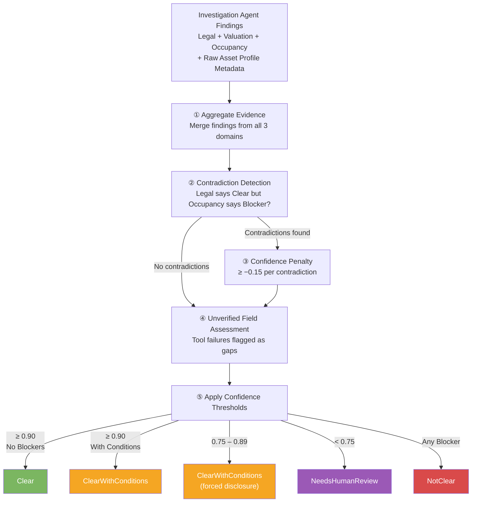
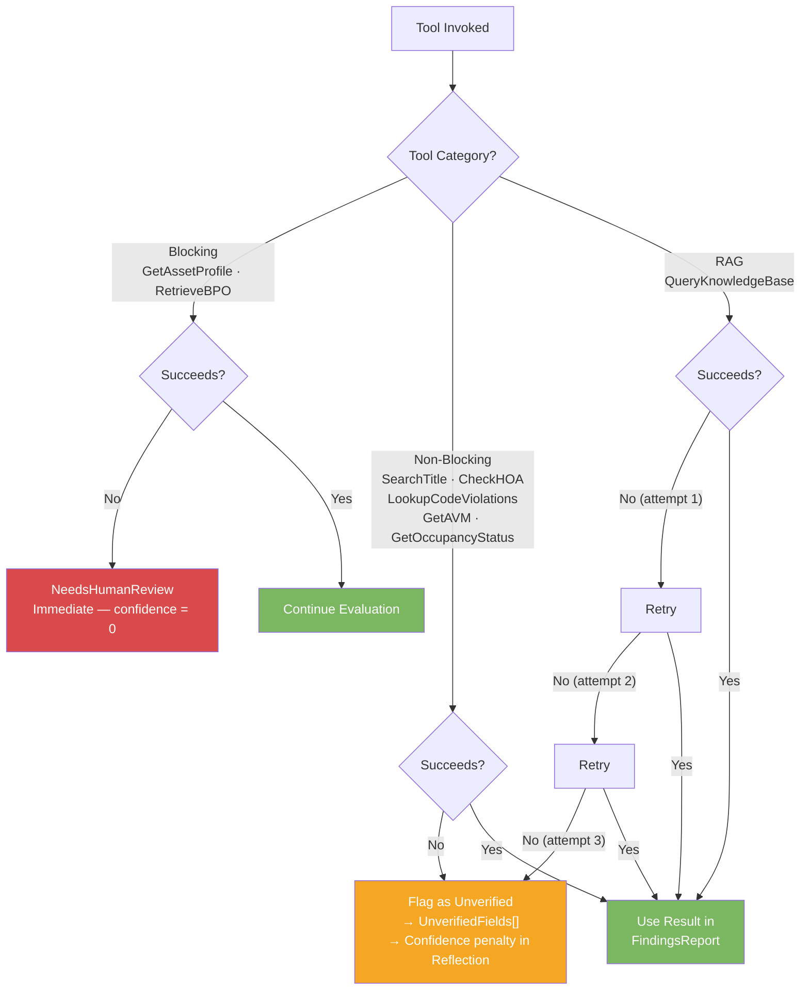
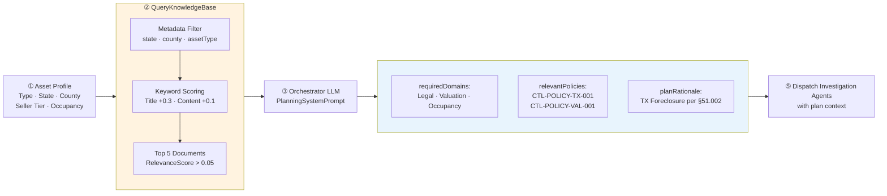
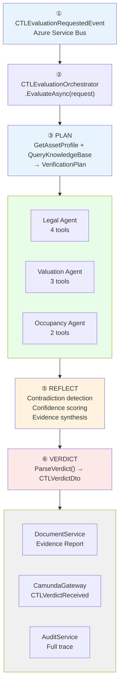
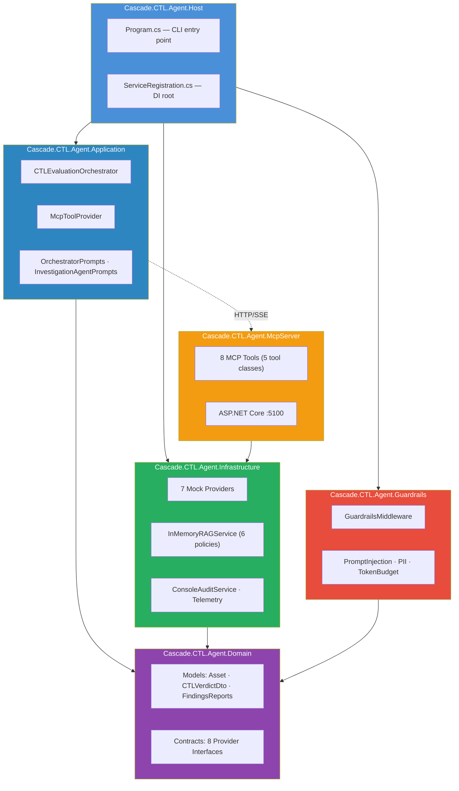

# Cascade 2.0 — CTL Agent: Agentic AI Architecture Diagrams

**Solution:** Asset Clear-To-List (CTL) Determination Agent  
**Focus:** Agentic AI Component Design  
**Aligned to:** Cascade.CTL.AgentSolution (.NET 8) · cascade2_ctl_agent_solution_architecture.md · CTL_Architecture_Readout.md  
**Date:** March 29, 2026

---

## 1. CTL Agent — System Overview

A single evaluation flow: event in, verdict out. Two processes — the Host orchestrates agents via LLM, the MCP Server exposes tools over HTTP/SSE.

---

## 2. 4-Phase Orchestration Pattern

The core agentic pattern — Plan, Investigate, Reflect, Decide. This is the `CTLEvaluationOrchestrator.EvaluateAsync()` method.

---

## 3. Agent Topology — Who Calls What

Four agents, eight tools. Each agent sees only its assigned tools via `McpToolProvider` role-based filtering. Investigation agents run concurrently and return structured findings to the Orchestrator.

---

## 4. MCP Client-Server Architecture

Two-process model. The Host connects to the MCP Server over HTTP/SSE using `McpClient.CreateAsync()`. Tools are auto-discovered via `[McpServerToolType]` attributes. `McpClientTool` implements `AITool` — direct use with `IChatClient`.

---

## 5. IChatClient Middleware Pipeline

Every LLM call passes through this pipeline. Built in `ServiceRegistration.ConfigureCTLAgent()` via `ChatClientBuilder`. The guardrails wrap the entire pipeline as a `DelegatingChatClient`.

---

## 6. Reflection & Verdict Decision Logic

The Orchestrator's reflection phase — how contradictions, confidence, and unverified fields determine the final verdict.

---

## 7. Tool Failure Cascade

Not all tool failures are equal. Blocking tools abort; non-blocking tools reduce confidence.

---

## 8. RAG-Grounded Planning

The Planner pattern — how the Orchestrator dynamically builds a verification plan using RAG policy retrieval before dispatching investigation agents.

**Policy Corpus (InMemoryRAGService):**

| ID | Scope | Coverage |
|----|-------|----------|
| CTL-POLICY-001 | All States | Baseline CTL requirements — title, BPO staleness, occupancy, confidence thresholds |
| CTL-POLICY-TX-001 | Texas Foreclosure | Property Code §51.002, no redemption, HOA Ch. 209, 60-day BPO |
| CTL-POLICY-CA-001 | California REO | Civil Code §2924, 1-year redemption, SB-1079, LA RSO, NHD |
| CTL-POLICY-HOA-001 | All States | HOA delinquency — $5k blocker, $1-5k conditional, super lien states |
| CTL-POLICY-VAL-001 | All States | BPO mandatory, staleness thresholds, AVM variance by state |
| CTL-POLICY-OCC-001 | All States | Occupancy clearance — vacant, eviction, unknown, cash-for-keys |

---

## 9. End-to-End Evaluation — Numbered Steps

The complete evaluation lifecycle from event trigger to verdict delivery, with numbered steps matching the implementation.

---

## 10. Solution Project Map

How the .NET solution projects map to the agentic architecture layers.

---

## Rendering

All diagrams use **Mermaid** — renders natively in:
- GitHub (README, PRs, Issues)
- VS Code (Markdown Preview / Mermaid extension)
- Azure DevOps Wiki
- Confluence (Mermaid macro)
- Any Mermaid-compatible renderer

No external tools, plugins, or PlantUML servers required.
