# Cascade 2.0 — CTL Agent: Enterprise Architecture Diagrams

**Document Type:** Architecture Diagram Companion  
**Solution:** Asset Clear-To-List (CTL) Determination Agent  
**Alignment:** Cascade.CTL.AgentSolution (.NET 8) + CTL_Architecture_Readout.md  
**Diagram Format:** PlantUML (`.puml` compatible — render via PlantUML server, VS Code plugin, or IntelliJ)  
**Prepared:** March 29, 2026

---

## Table of Contents

1. [System Context Diagram](#1-system-context-diagram)
2. [CTL Agent Host — Internal Architecture (Container Diagram)](#2-ctl-agent-host--internal-architecture)
3. [4-Phase Orchestration Sequence](#3-4-phase-orchestration-sequence)
4. [Agent Topology & Workflow](#4-agent-topology--workflow)
5. [MCP Client-Server Architecture](#5-mcp-client-server-architecture)
6. [IChatClient Middleware Pipeline](#6-ichatclient-middleware-pipeline)
7. [Guardrails Screening Pipeline](#7-guardrails-screening-pipeline)
8. [Domain Model Class Diagram](#8-domain-model-class-diagram)
9. [RAG Architecture](#9-rag-architecture)
10. [Infrastructure & Deployment Topology](#10-infrastructure--deployment-topology)
11. [Tool Failure Cascade Policy](#11-tool-failure-cascade-policy)
12. [DI Composition Root](#12-di-composition-root)

---

## 1. System Context Diagram

Shows the CTL Agent system boundary and all external actors/systems it interacts with — aligned to the Cascade 2.0 platform integration contracts.

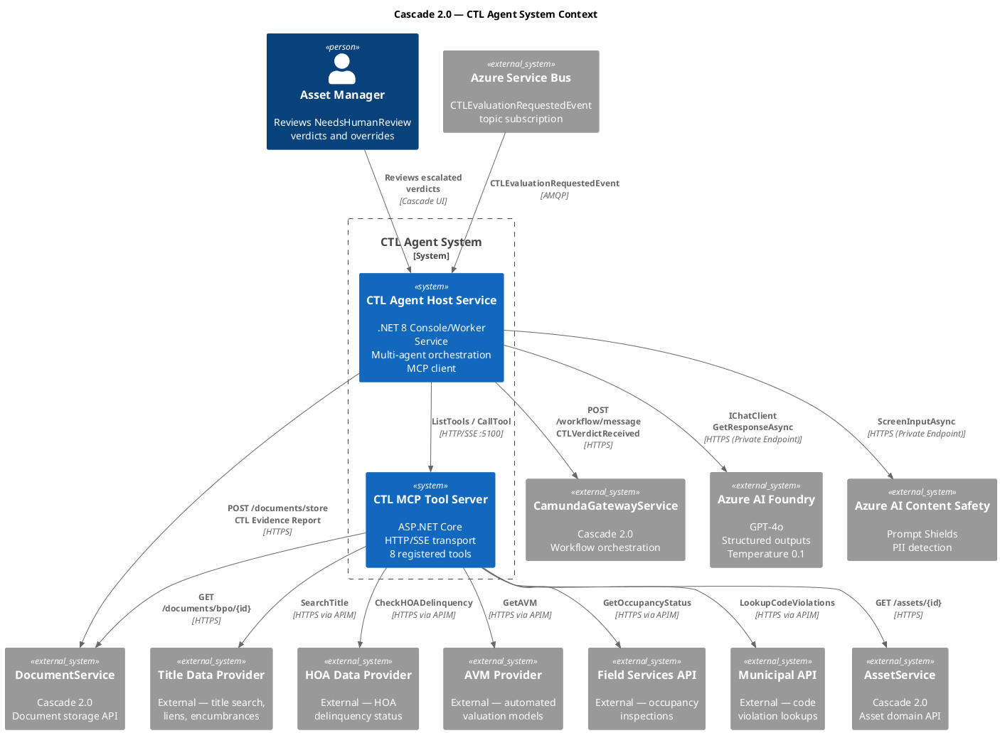

---

## 2. CTL Agent Host — Internal Architecture

Maps directly to the .NET solution project structure (`src/` folders) and the DI composition root in `ServiceRegistration.cs`.

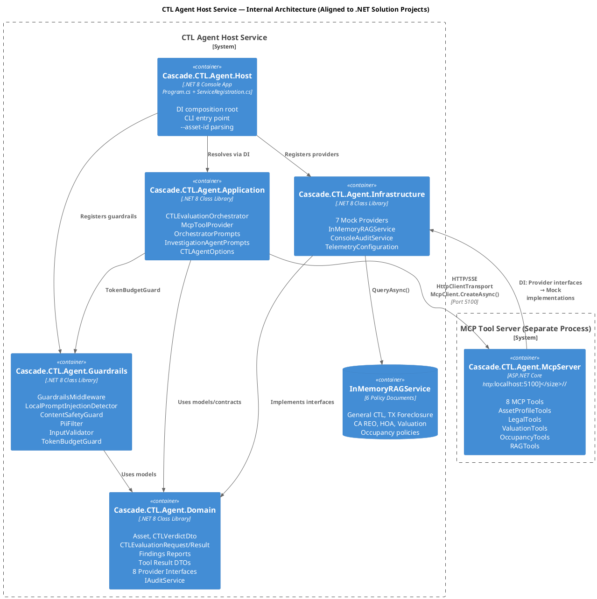

---

## 3. 4-Phase Orchestration Sequence

Precise sequence diagram of `CTLEvaluationOrchestrator.EvaluateAsync()` — every phase, every method call, every tool invocation, exactly as implemented.

```plantuml
@startuml CTL_Orchestration_Sequence
!theme cerulean-outline

title CTL Evaluation — 4-Phase Orchestration Sequence\n(CTLEvaluationOrchestrator.EvaluateAsync)

skinparam sequenceMessageAlign center
skinparam maxMessageSize 220

actor "CLI / Service Bus" as CLI
participant "CTLEvaluation\nOrchestrator" as ORCH
participant "IChatClient\n(Pipeline)" as LLM
participant "McpToolProvider" as MCP
participant "MCP Server\n:5100" as MCPS
participant "IAuditService" as AUDIT
participant "TokenBudgetGuard" as TBG

== Initialization ==

CLI -> ORCH : EvaluateAsync(CTLEvaluationRequest)
activate ORCH
ORCH -> AUDIT : RecordStepAsync("EvaluationStarted")

== Phase 1 — PLANNING ==

ORCH -> MCP : GetToolsForOrchestrator()
MCP --> ORCH : [GetAssetProfile, QueryKnowledgeBase]

ORCH -> LLM : GetResponseAsync(\n  system: OrchestratorPrompts.PlanningSystemPrompt,\n  user: "Evaluate asset {assetId}...",\n  tools: [GetAssetProfile, QueryKnowledgeBase],\n  Temperature: 0.1)
activate LLM

LLM -> MCPS : CallTool: GetAssetProfile(assetId)
MCPS --> LLM : Asset JSON
LLM -> MCPS : CallTool: QueryKnowledgeBase(\n  query, stateCode, assetType)
MCPS --> LLM : RAGQueryResult JSON

LLM --> ORCH : Planning response\n{requiredDomains, relevantPolicies,\nassetProfileSummary, planRationale}
deactivate LLM

ORCH -> AUDIT : RecordStepAsync("PlanGenerated")

== Phase 2 — INVESTIGATION AGENT FAN-OUT (Task.WhenAll) ==

ORCH -> AUDIT : RecordStepAsync("InvestigationAgentStarted: Legal")
ORCH -> AUDIT : RecordStepAsync("InvestigationAgentStarted: Valuation")
ORCH -> AUDIT : RecordStepAsync("InvestigationAgentStarted: Occupancy")

par Legal Agent
    ORCH -> MCP : GetToolsForLegalAgent()
    MCP --> ORCH : [SearchTitle, CheckHOADelinquency,\nLookupCodeViolations, QueryKnowledgeBase]

    ORCH -> LLM : GetResponseAsync(\n  system: InvestigationAgentPrompts.LegalAgentSystemPrompt,\n  user: planningOutput + assetContext,\n  tools: legalTools)
    activate LLM #LightBlue
    LLM -> MCPS : CallTool: SearchTitle(parcelId, stateCode)
    MCPS --> LLM : TitleSearchResult
    LLM -> MCPS : CallTool: CheckHOADelinquency(address)
    MCPS --> LLM : HOAResult
    LLM -> MCPS : CallTool: LookupCodeViolations(address, county)
    MCPS --> LLM : CodeViolationResult
    LLM --> ORCH : LegalFindingsReport JSON
    deactivate LLM

else Valuation Agent
    ORCH -> MCP : GetToolsForValuationAgent()
    MCP --> ORCH : [RetrieveBPO, GetAVM, QueryKnowledgeBase]

    ORCH -> LLM : GetResponseAsync(\n  system: InvestigationAgentPrompts.ValuationAgentSystemPrompt,\n  user: planningOutput + assetContext,\n  tools: valuationTools)
    activate LLM #LightGreen
    LLM -> MCPS : CallTool: RetrieveBPO(assetId)
    MCPS --> LLM : BPOResult
    LLM -> MCPS : CallTool: GetAVM(address, stateCode)
    MCPS --> LLM : AVMResult
    LLM --> ORCH : ValuationFindingsReport JSON
    deactivate LLM

else Occupancy Agent
    ORCH -> MCP : GetToolsForOccupancyAgent()
    MCP --> ORCH : [GetOccupancyStatus, QueryKnowledgeBase]

    ORCH -> LLM : GetResponseAsync(\n  system: InvestigationAgentPrompts.OccupancyAgentSystemPrompt,\n  user: planningOutput + assetContext,\n  tools: occupancyTools)
    activate LLM #LightCoral
    LLM -> MCPS : CallTool: GetOccupancyStatus(address)
    MCPS --> LLM : OccupancyStatusResult
    LLM --> ORCH : OccupancyFindingsReport JSON
    deactivate LLM
end

ORCH -> AUDIT : RecordStepAsync("InvestigationAgentCompleted: Legal")
ORCH -> AUDIT : RecordStepAsync("InvestigationAgentCompleted: Valuation")
ORCH -> AUDIT : RecordStepAsync("InvestigationAgentCompleted: Occupancy")

== Phase 3 — REFLECTION ==

ORCH -> MCP : GetToolsForOrchestrator()

ORCH -> LLM : GetResponseAsync(\n  system: OrchestratorPrompts.ReflectionSystemPrompt,\n  user: legalFindings + valuationFindings\n         + occupancyFindings + planningOutput\n         + assetProfileJson (raw metadata),\n  tools: [GetAssetProfile, QueryKnowledgeBase])
activate LLM #Wheat
LLM --> ORCH : Reflection JSON\n{verdict, confidenceScore,\nconditions[], evidenceTrail[],\nreflectionLog}
deactivate LLM

ORCH -> AUDIT : RecordStepAsync("ReflectionCompleted")

== Phase 4 — VERDICT PARSING ==

ORCH -> ORCH : ParseVerdict(reflectionJson)
note right
  Extract JSON substring
  Deserialize → VerdictJsonResponse
  Map → CTLVerdictDto
  Fallback: NeedsHumanReview
end note

ORCH -> TBG : CurrentUsage (for metrics)
ORCH -> AUDIT : RecordStepAsync("EvaluationCompleted",\n  duration, tokenCount, toolCount)

ORCH --> CLI : CTLEvaluationResult\n{Verdict, Duration, TokensUsed, ToolCount}
deactivate ORCH

@enduml
```

---

## 4. Agent Topology & Workflow

Shows all four agents, their tool assignments, output types, and the data flow between them — exactly matching `McpToolProvider` filtering and orchestrator dispatch.

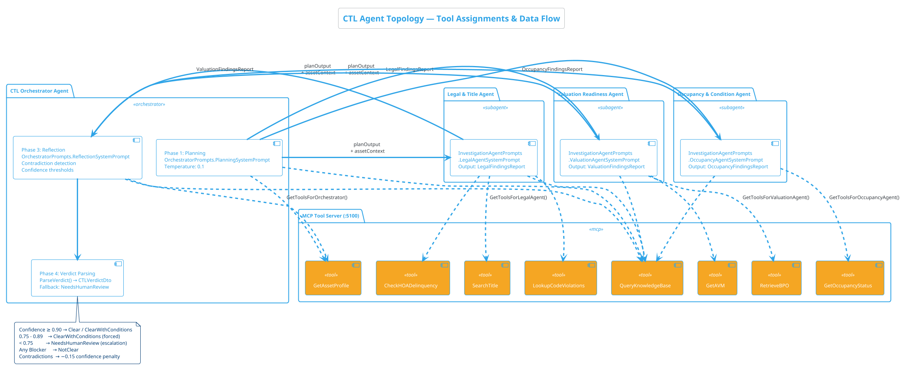

---

## 5. MCP Client-Server Architecture

Precise transport, discovery, and invocation flow between `McpToolProvider` (Application layer) and the `McpServer` (ASP.NET Core process).

```plantuml
@startuml MCP_Architecture
!theme cerulean-outline

title MCP Client-Server Architecture\n(ModelContextProtocol SDK 1.2.0)

skinparam rectangle {
    BackgroundColor<<client>> #E8F4FD
    BackgroundColor<<server>> #FDE8E8
    BackgroundColor<<provider>> #E8FDE8
}

rectangle "Cascade.CTL.Agent.Application" <<client>> {
    rectangle "McpToolProvider" as MCPC {
        card "HttpClientTransport" as TRANS
        card "HttpTransportMode.Sse" as MODE
        card "McpClient.CreateAsync(transport)" as CREATE
        card "client.ListToolsAsync()" as LIST
        note right of LIST
          Returns IList<McpClientTool>
          McpClientTool : AITool
          → Direct use in ChatOptions.Tools
        end note
    }

    rectangle "Tool Filtering (Role-based)" as FILTER {
        card "GetToolsForOrchestrator()\n→ GetAssetProfile, QueryKnowledgeBase" as F_ORCH
        card "GetToolsForLegalAgent()\n→ SearchTitle, CheckHOADelinquency,\n   LookupCodeViolations, QueryKnowledgeBase" as F_LEGAL
        card "GetToolsForValuationAgent()\n→ RetrieveBPO, GetAVM, QueryKnowledgeBase" as F_VAL
        card "GetToolsForOccupancyAgent()\n→ GetOccupancyStatus, QueryKnowledgeBase" as F_OCC
    }
}

rectangle "Cascade.CTL.Agent.McpServer\nhttp://localhost:5100" <<server>> {
    rectangle "ASP.NET Core Minimal API" as API {
        card "AddMcpServer()\n  .WithHttpTransport()\n  .WithToolsFromAssembly()" as SETUP
        card "app.MapMcp()" as MAP
    }

    rectangle "[McpServerToolType] Classes" as TOOLS {
        card "AssetProfileTools\n  [McpServerTool] GetAssetProfile(assetId)" as ST_ASSET
        card "LegalTools\n  [McpServerTool] SearchTitle(parcelId, stateCode)\n  [McpServerTool] CheckHOADelinquency(address)\n  [McpServerTool] LookupCodeViolations(address, county)" as ST_LEGAL
        card "ValuationTools\n  [McpServerTool] RetrieveBPO(assetId)\n  [McpServerTool] GetAVM(address, stateCode)" as ST_VAL
        card "OccupancyTools\n  [McpServerTool] GetOccupancyStatus(address)" as ST_OCC
        card "RAGTools\n  [McpServerTool] QueryKnowledgeBase(query, state?, county?, assetType?)" as ST_RAG
    }
}

rectangle "Infrastructure (DI in MCP Server)" <<provider>> {
    card "IAssetProfileProvider → MockAssetProfileProvider" as P1
    card "ITitleSearchProvider → MockTitleSearchProvider" as P2
    card "IHOAProvider → MockHOAProvider" as P3
    card "ICodeViolationProvider → MockCodeViolationProvider" as P4
    card "IBPOProvider → MockBPOProvider" as P5
    card "IAVMProvider → MockAVMProvider" as P6
    card "IOccupancyProvider → MockOccupancyProvider" as P7
    card "IRAGQueryService → InMemoryRAGService" as P8
}

TRANS -down-> MODE
MODE -down-> CREATE
CREATE -right-> LIST
LIST -down-> FILTER

MCPC -down[#blue,bold]-> API : "HTTP/SSE\nListTools → 8 tools\nCallTool → JSON result"

SETUP -down-> MAP
MAP -down-> TOOLS

TOOLS -down-> P1
TOOLS -down-> P2
TOOLS -down-> P3
TOOLS -down-> P4
TOOLS -down-> P5
TOOLS -down-> P6
TOOLS -down-> P7
TOOLS -down-> P8

@enduml
```

---

## 6. IChatClient Middleware Pipeline

Exact pipeline from `ServiceRegistration.ConfigureCTLAgent()` — every middleware layer, bottom-to-top.

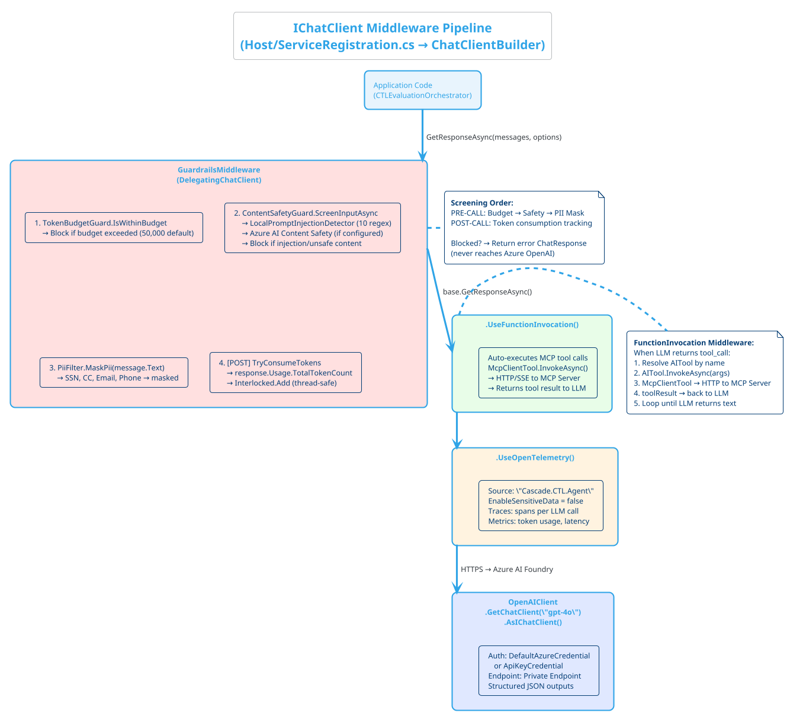

---

## 7. Guardrails Screening Pipeline

Detailed breakdown of every guard, pattern, and decision path in `GuardrailsMiddleware`.

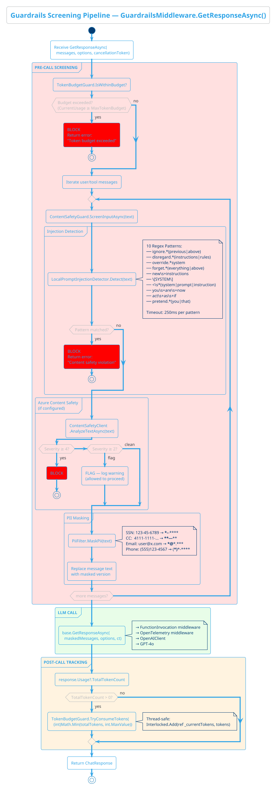

---

## 8. Domain Model Class Diagram

Complete domain model exactly as defined in `Cascade.CTL.Agent.Domain` — enums, records, interfaces.

```plantuml
@startuml Domain_Model
!theme cerulean-outline

skinparam classAttributeIconSize 0
skinparam classFontSize 11
hide empty methods

title Cascade.CTL.Agent.Domain — Complete Model

package "Enums" #EEEEFF {
    enum CTLVerdict {
        Clear
        ClearWithConditions
        NotClear
        NeedsHumanReview
    }

    enum AssetType {
        Foreclosure
        NonForeclosure
        REO
        ShortSale
    }

    enum OccupancyStatus {
        Vacant
        Occupied
        Unknown
    }

    enum SellerTier {
        Tier1
        Tier2
        Tier3
    }

    enum VerificationDomain {
        Legal
        Valuation
        Occupancy
    }
}

package "Models" #EEFFEE {
    class Asset <<record>> {
        +AssetId : string
        +AssetType : AssetType
        +StateCode : string
        +County : string
        +SellerTier : SellerTier
        +OccupancyStatus : OccupancyStatus
        +ParcelId : string
        +PropertyAddress : string
        +SellerName? : string
        +IngestionDate? : DateTime
    }

    class CTLEvaluationRequest <<record>> {
        +AssetId : string {required}
        +WorkflowInstanceId? : string
        +RequestTimestamp : DateTime
        +RequestedBy? : string
    }

    class CTLEvaluationResult <<record>> {
        +Verdict : CTLVerdictDto
        +EvaluationDuration : TimeSpan
        +TotalTokensUsed : int
        +ToolInvocationCount : int
    }

    class CTLVerdictDto <<record>> {
        +Verdict : CTLVerdict
        +ConfidenceScore : double [0.0-1.0]
        +Conditions : string[]
        +EvidenceTrail : string[]
        +ReflectionLog : string
        +AssetId : string
        +Timestamp : DateTime
        +SessionId : string
        +LegalFindings? : LegalFindingsReport
        +ValuationFindings? : ValuationFindingsReport
        +OccupancyFindings? : OccupancyFindingsReport
    }

    class VerificationPlan <<record>> {
        +AssetId : string
        +RequiredDomains : VerificationDomain[]
        +RelevantPolicies : string[]
        +AssetProfileSummary : string
        +PlanRationale : string
    }
}

package "Findings Reports" #FFEEEE {
    class LegalFindingsReport <<record>> {
        +DomainVerdict : string
        +Confidence : double
        +Findings : string[]
        +UnverifiedFields : string[]
        +Summary : string
        +TitleResult? : TitleSearchResult
        +HOAResult? : HOAResult
        +CodeViolationResult? : CodeViolationResult
    }

    class ValuationFindingsReport <<record>> {
        +DomainVerdict : string
        +Confidence : double
        +Findings : string[]
        +UnverifiedFields : string[]
        +Summary : string
        +BPOResult? : BPOResult
        +AVMResult? : AVMResult
    }

    class OccupancyFindingsReport <<record>> {
        +DomainVerdict : string
        +Confidence : double
        +Findings : string[]
        +UnverifiedFields : string[]
        +Summary : string
        +OccupancyResult? : OccupancyStatusResult
    }
}

package "Tool Results" #FFFFEE {
    class TitleSearchResult <<record>> {
        +ParcelId, StateCode : string
        +HasClearTitle : bool
        +OpenLiens : string[]
        +Encumbrances : string[]
        +TitleDefects : string[]
        +HasHOAFlag : bool
        +SearchDate : DateTime
    }

    class HOAResult <<record>> {
        +PropertyAddress : string
        +HasHOA, IsDelinquent : bool
        +DelinquentAmount? : decimal
        +HOAName? : string
        +Status : string
    }

    class CodeViolationResult <<record>> {
        +PropertyAddress, County : string
        +HasOpenViolations : bool
        +Violations : CodeViolation[]
    }

    class BPOResult <<record>> {
        +AssetId : string
        +HasBPO : bool
        +EstimatedValue? : decimal
        +BPODate? : DateTime
        +IsStale : bool
        +DaysSinceBPO? : int
        +QualityRating : string
    }

    class AVMResult <<record>> {
        +PropertyAddress, StateCode : string
        +HasAVM : bool
        +EstimatedValue? : decimal
        +ConfidenceScore? : double
        +VariancePercentage? : double
    }

    class OccupancyStatusResult <<record>> {
        +PropertyAddress : string
        +OccupancyStatus : OccupancyStatus
        +IsVacant : bool
        +HasEvictionInProgress : bool
        +PropertyCondition? : string
        +Notes : string[]
    }

    class RAGQueryResult <<record>> {
        +Query : string
        +Documents : RAGDocument[]
        +TotalMatches : int
    }
}

package "Contracts" #EEEEFF {
    interface IAssetProfileProvider {
        +GetAssetProfileAsync(assetId) : Task<Asset>
    }
    interface ITitleSearchProvider {
        +SearchAsync(parcelId, stateCode) : Task<TitleSearchResult>
    }
    interface IHOAProvider {
        +CheckDelinquencyAsync(address) : Task<HOAResult>
    }
    interface ICodeViolationProvider {
        +LookupAsync(address, county) : Task<CodeViolationResult>
    }
    interface IBPOProvider {
        +RetrieveAsync(assetId) : Task<BPOResult>
    }
    interface IAVMProvider {
        +GetValuationAsync(address, state) : Task<AVMResult>
    }
    interface IOccupancyProvider {
        +GetStatusAsync(address) : Task<OccupancyStatusResult>
    }
    interface IRAGQueryService {
        +QueryAsync(query, state?, county?, assetType?) : Task<RAGQueryResult>
    }
    interface IAuditService {
        +RecordStepAsync(AuditEntry) : Task
    }
}

CTLEvaluationResult *-- CTLVerdictDto
CTLVerdictDto *-- LegalFindingsReport
CTLVerdictDto *-- ValuationFindingsReport
CTLVerdictDto *-- OccupancyFindingsReport
CTLVerdictDto --> CTLVerdict
Asset --> AssetType
Asset --> OccupancyStatus
Asset --> SellerTier
VerificationPlan --> VerificationDomain

@enduml
```

---

## 9. RAG Architecture

Exact implementation from `InMemoryRAGService` — documents, scoring, filtering.

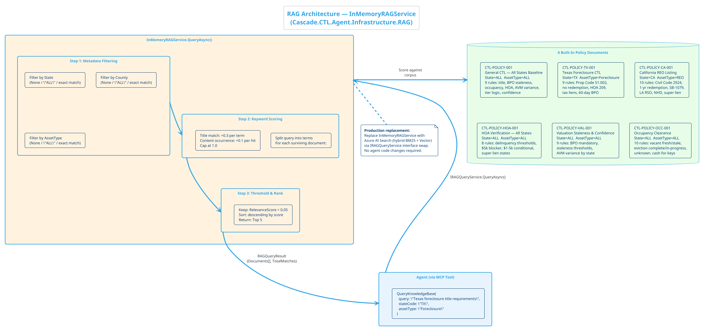

---

## 10. Infrastructure & Deployment Topology

Target-state deployment aligned with the ARB architecture — Azure Container Apps, Private Endpoints, Managed Identity.

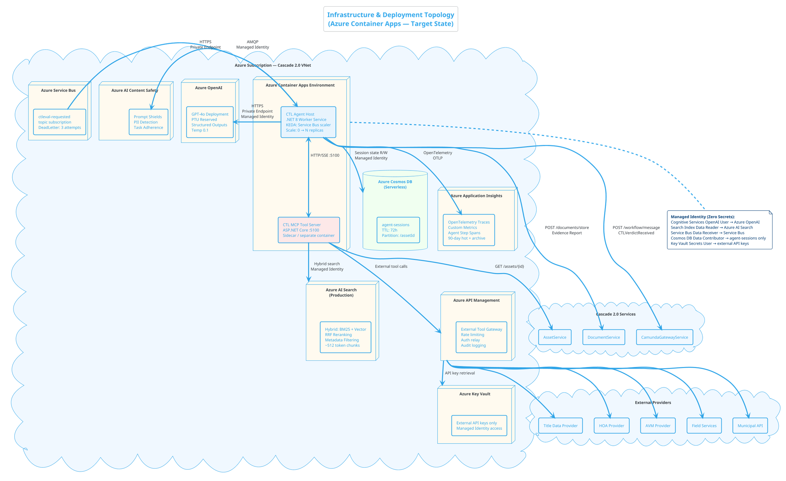

---

## 11. Tool Failure Cascade Policy

Decision tree for tool failures — blocking vs. non-blocking, exactly as designed in the architecture.

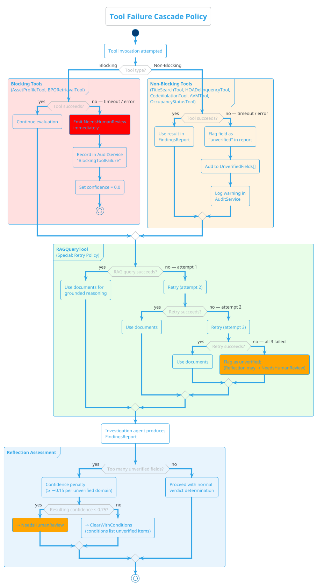

---

## 12. DI Composition Root

Complete dependency injection registration flow in `ServiceRegistration.ConfigureCTLAgent()`.

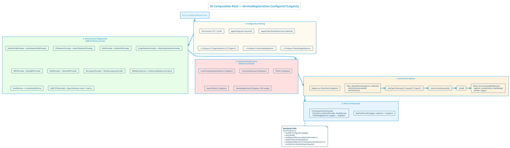

---

## Rendering Instructions

### Option A — VS Code PlantUML Extension
1. Install "PlantUML" extension by jebbs
2. Copy any `@startuml ... @enduml` block to a `.puml` file
3. `Alt+D` to preview

### Option B — PlantUML Server
1. Visit [https://www.plantuml.com/plantuml/uml](https://www.plantuml.com/plantuml/uml)
2. Paste any diagram block
3. Generate SVG/PNG

### Option C — CLI
```bash
java -jar plantuml.jar diagram.puml -tsvg
```

### Option D — Docker
```bash
docker run -v $(pwd):/data plantuml/plantuml diagram.puml -tsvg
```

---

## Diagram-to-Code Traceability Matrix

| Diagram | Primary Source Files |
|---------|-------------------|
| System Context | Host/Program.cs, McpServer/Program.cs, Application/Orchestration/*.cs |
| Internal Architecture | All .csproj files, ServiceRegistration.cs |
| 4-Phase Sequence | Application/Orchestration/CTLEvaluationOrchestrator.cs |
| Agent Topology | Application/Orchestration/McpToolProvider.cs, Application/Prompts/*.cs |
| MCP Architecture | McpServer/Program.cs, McpServer/Tools/*.cs, Application/Orchestration/McpToolProvider.cs |
| IChatClient Pipeline | Host/ServiceRegistration.cs |
| Guardrails Pipeline | Guardrails/GuardrailsMiddleware.cs, Guardrails/*.cs |
| Domain Model | Domain/Models/*.cs, Domain/Enums/*.cs, Domain/Contracts/*.cs |
| RAG Architecture | Infrastructure/RAG/InMemoryRAGService.cs |
| Infrastructure Topology | Architecture design (target-state Azure deployment) |
| Tool Failure Policy | Architecture design + CTLEvaluationOrchestrator error handling |
| DI Composition | Host/ServiceRegistration.cs, Infrastructure/InfrastructureRegistration.cs, Guardrails/GuardrailsRegistration.cs |

---

*All diagrams are verified against the implemented .NET solution at `Cascade.CTL.AgentSolution/` and the CTL_Architecture_Readout.md. No misalignment with finalized architecture, solution, or use case.*
