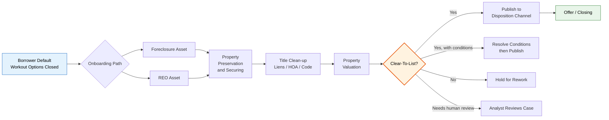
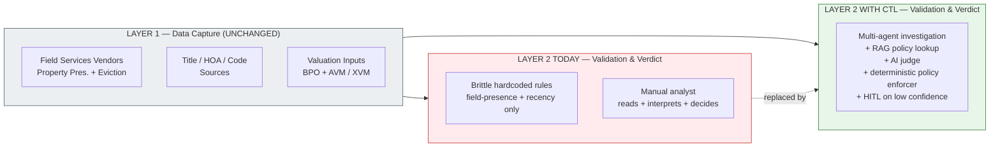
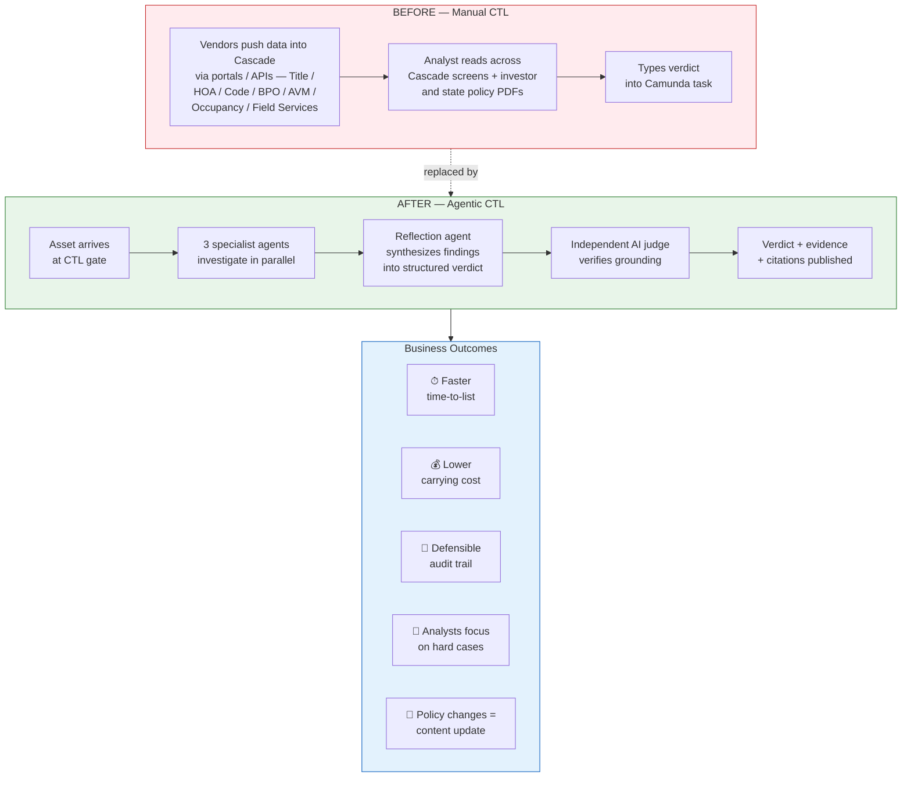

# Use Case

**Subject:** What problem does this solution actually solve, and is the use case real?

---

## 1. The Use Case in One Sentence

> Before any distressed property can be **listed for sale**, somebody has to declare it **Clear-To-List (CTL)** — *legally clean, properly valued, and physically ready*. This solution produces that declaration automatically — with evidence and policy citations — instead of leaving it to an analyst reading across vendor outputs by hand, or to brittle hardcoded rules that can only check whether a field is populated and recent.

---
## 2. Where CTL Sits — Asset Disposition Path

Everything to the left of the diamond is operational prep that Cascade 2.0 already does; everything to the right is sales execution. **CTL is the gating decision that releases an asset from inventory carrying-cost into market exposure.**

---

## 3. What CTL Replaces — and What It Does Not

### Layer 1 — Data capture (upstream of CTL): vendor-driven, *unchanged by this solution*

The *facts themselves* are produced by external operators (or proprietary in-house systems, e.g., Xome's XVM for valuation) and flow into Cascade 2.0 through established integrations. CTL **does not replace any of this**. *(Vendor names below are industry examples for context, not statements about specific Cascade integrations.)*

| Step                                            | Typical capture pattern (industry examples)                                                                                                                                     | Inherently manual element (at the vendor)                          |
| ----------------------------------------------- | ------------------------------------------------------------------------------------------------------------------------------------------------------------------------------- | ------------------------------------------------------------------ |
| **Property Preservation & Eviction**            | Field-service vendors *(e.g., Safeguard, MCS, Cyprexx, Five Brothers)* dispatch contractors; photos + condition reports typically flow back via VOM feeds. Eviction milestones posted by attorney networks. | Contractor on-site inspection; attorney free-text status notes.    |
| **Title Curative / HOA / Liens / Code Violations** | Title vendors *(e.g., ServiceLink, Stewart, FNF, Old Republic)* deliver title commitments + Schedule B PDFs. HOA estoppels often via HomeWiseDocs / Sperlonga. Code violations sourced from BuildFax / ATTOM / municipal portals. | Title examiner drafting Schedule B; mgmt company issuing estoppel. |
| **Valuation (BPO + AVM)**                       | Brokers submit BPOs through valuation platforms; AVM signals come from automated models — either third-party AVMs *(e.g., CoreLogic, HouseCanary)* or proprietary in-house models *(e.g., Xome's XVM)*.                                | Broker drive-by/interior inspection and comp selection.            |

The "manual" piece here is the **human in the field producing the input** (broker, inspector, examiner). Their output flows into the servicing platform as structured data + attached documents. **That stays exactly where it is.**

### Layer 2 — Validation & verdict (the CTL gate): *this is what the agent replaces*

Once vendor data has landed, somebody has to (1) read across all of it, (2) validate it is sufficient/fresh/internally consistent, (3) interpret unstructured pieces (Schedule B legal prose, inspector remarks, BPO-vs-AVM variance), (4) apply the right investor + state + program policy, and (5) declare a verdict with citations.

Today this is handled by a thin mix of:

- **(a) Hardcoded rules** (in workflow gateways, microservices, or both) — can only check *presence* and *recency* ("is BPO < 90 days old? is field populated?"). Cannot interpret prose, cannot reconcile vendor disagreements, cannot keep up with quarterly policy churn across investors × states × programs.
- **(b) Manual analyst review** — the bottleneck. Analyst reads across Cascade screens (where vendors have already submitted their data) plus investor + state policy bulletins, weighs the evidence, and types the verdict.

> **In one line:** vendors keep capturing the data the same way; CTL takes over the **validation and verdict on top of that data** — the piece that today is either an analyst reading Schedule B by eye or a hardcoded rule that can only ask *"is this field populated?"* It does **not** replace the vendor capture above it, and it does **not** replace the deterministic governance (policy enforcer, HITL routing) below it.

---

## 4. Business-Friendly View — Who Wins, and How

