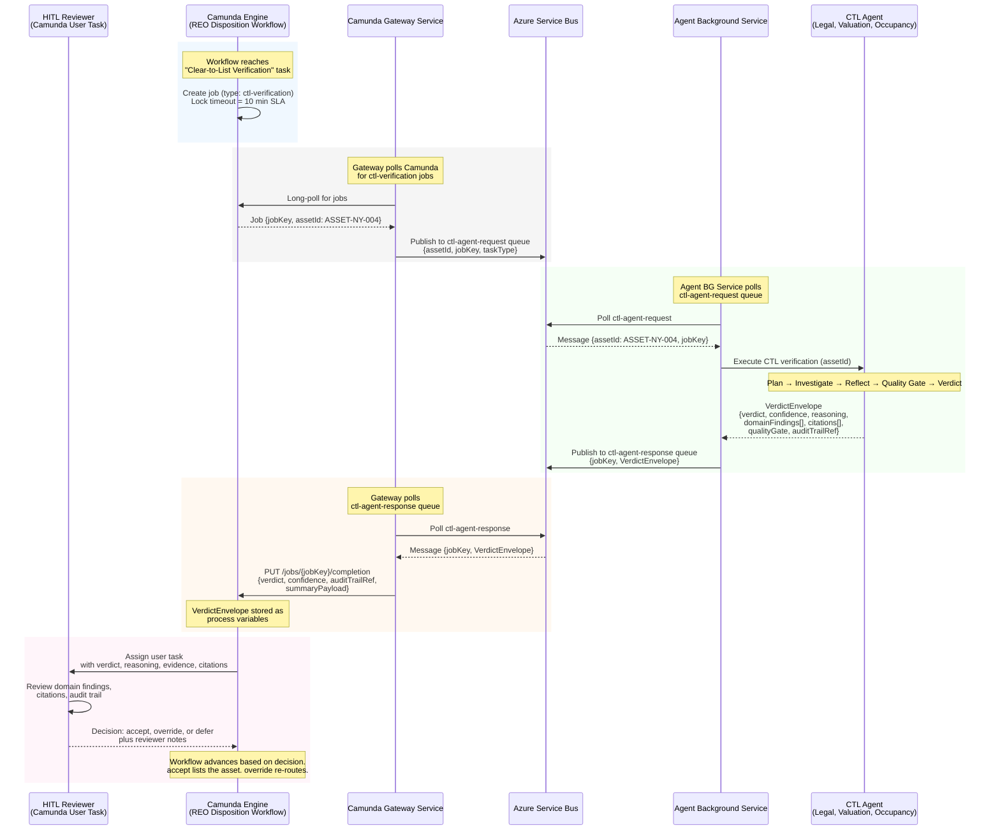

# CTL Agent – Camunda Integration Architecture

## 1. Decision Summary

| Decision | Rationale |
|----------|-----------|
| Async messaging via Azure Service Bus | Agent execution is non-deterministic (24s+ today, longer with HITL/retries); eliminates HTTP timeout fragility |
| Agent Background Service owns ASB integration | Agent core stays infrastructure-agnostic; messaging concerns isolated at boundary |
| Job Worker holds lock until completion | Camunda-idiomatic; simpler BPMN, built-in retry on timeout, no extra message catch events |
| No REST API endpoint (deferred) | No non-Camunda consumer exists today; can be added later as thin submission layer |

---

## 2. Architecture Diagram

```
+----------------+      +-------------------+      +-------------------+      +-------------------+
|                |      |                   |      |                   |      |                   |
| CAMUNDA ENGINE | <--> |  CAMUNDA GATEWAY  | <--> | AZURE SERVICE BUS | <--> | AGENT BG SERVICE  |
|                |      |      SERVICE      |      |                   |      |                   |
+----------------+      +-------------------+      +-------------------+      +---------+---------+
                                                                                         |
                                                                                         v
                                                                              +-------------------+
                                                                              |                   |
                                                                              |     CTL AGENT     |
                                                                              | (Legal | Valuation|
                                                                              |    | Occupancy)   |
                                                                              +-------------------+
```

---

## 3. Sequence Diagram

> The Camunda Gateway Service decouples Camunda from external services via Azure Service Bus.
> All consumers poll — no push delivery. Neither Camunda nor the Agent knows about each other.



---

## 4. Why Async over Synchronous REST

> **Cascade 2.0's existing async pattern fits agentic AI perfectly — zero new infrastructure, the agent just becomes another async consumer.**

| Concern | Sync REST | Async (ASB) |
|---------|-----------|-------------|
| Timeout | TCP/HTTP timeout across all hops must exceed agent runtime | No open connection; job timeout is a configurable business SLA |
| Latency variance | Hard to set reliable timeout for 2s–60s+ LLM calls | Irrelevant — message sits until consumed |
| Retry safety | Timeout ≠ failure (agent may have already committed) → duplicates | Camunda retries by re-publishing; agent is idempotent per jobKey |
| Backpressure | No natural throttle; Camunda can flood agent beyond rate limits | Queue depth + consumer scaling provides natural throttle |
| Coupling | Agent must expose HTTP endpoint; Camunda must know agent URL | Both sides only know ASB queue names |
| HITL pauses | Connection cannot survive minutes/hours of human review | Message sits in queue indefinitely until reviewer responds |

---

## 5. Verdict Envelope Contract

A bare `verdict` value is insufficient for HITL review, audit, and regulatory compliance
(NIST AI RMF, EU AI Act high-risk systems, OCC/CFPB adverse-action documentation).
The agent returns a **structured envelope** so reviewers can defer or accept the verdict
based on evidence — never blindly.

```jsonc
{
  "jobKey": "camunda-job-7f3a...",
  "assetId": "ASSET-NY-004",
  "verdict": "ClearWithConditions",          // Clear | ClearWithConditions | NeedsHumanReview | Blocked
  "confidence": 0.87,                        // 0.0 - 1.0, post quality-gate
  "reasoning": "Lien confirmed released on 2026-03-12; HOA verified current; ...",
  "domainFindings": [
    {
      "domain": "Legal",
      "status": "Pass",
      "findings": ["Title chain clean", "No active liens"],
      "citations": ["doc://lien-release/abc123#p2", "policy://title-clearance-policy#sec-4.2"]
    },
    { "domain": "Valuation",  "status": "Pass",       "findings": [...], "citations": [...] },
    { "domain": "Occupancy",  "status": "Conditional","findings": [...], "citations": [...] }
  ],
  "qualityGate": {
    "groundednessScore": 4,                  // 1-5, LLM-as-judge
    "passed": true,                          // false when score < threshold
    "escalated": false                       // true when passed=false; orchestrator overrode verdict to NeedsHumanReview
  },
  "conditions": ["Verify HOA fees current at closing"],
  "auditTrailRef": "audit-logs/0320ecfc30d7.jsonl",  // full step-by-step trace
  "tokensUsed": 5001,
  "elapsedMs": 23900,
  "agentVersion": "ctl-agent@v1.4.2"
}
```

**What HITL reviewers get:**
- **Verdict + confidence** — quick triage signal
- **Reasoning** — natural-language explanation
- **Domain findings + citations** — drill-down to source evidence (documents, policies, RAG hits)
- **Quality gate score** — was the reasoning grounded in evidence? (judged by independent LLM)
- **Audit trail reference** — full deterministic replay (plan, tool calls, prompts, responses)

**What downstream systems get:**
- `verdict` for routing (BPMN gateway: `ClearWithConditions` → conditions task; `NeedsHumanReview` → human task)
- `auditTrailRef` for compliance / forensics
- `agentVersion` for model-drift attribution

---

## 6. Timeout Model

```
Camunda Job Timeout (SLA: 10 min)
├── If agent completes within SLA → Gateway completes job → workflow advances
└── If timeout fires → Camunda retries job (re-publishes to request queue)
```

- **Not** an HTTP socket timeout (infrastructure-bound, fragile)
- **Is** a business SLA timeout (configurable, observable, retry-safe)
- Agent Background Service has no timeout — it processes until done
- **Idempotency**: Camunda Gateway dedupes by `jobKey` on both ingress (skip if job already in-flight) and egress (skip if job already completed) — prevents double-processing on retry

---

## 7. Component Responsibilities

| Component | Responsibility |
|-----------|---------------|
| **Camunda Engine** | Hosts BPMN workflow; locks job with SLA timeout; advances workflow on completion |
| **Camunda Gateway Service** | Polls Camunda for jobs; publishes requests to ASB; polls ASB for verdicts; completes job via Camunda REST API |
| **Agent Background Service** | Polls ASB request queue; invokes agent orchestrator; publishes result to ASB response queue |
| **CTL Agent (Orchestrator)** | Receive assetId → Plan → Investigate → Reflect → return verdict. Zero knowledge of ASB/Camunda. |

---

## 8. Future Extension (Deferred)

If non-Camunda consumers emerge, add a thin REST API:

```
POST /api/agent/ctl-verification
Body: { assetId, correlationId }
Response: 202 Accepted

→ Internally publishes to same ASB request queue
→ Agent Background Service processes identically
→ Result delivered via ASB response queue (consumer routes by correlationId)
```

No agent code changes required — only a new HTTP ingress adapter.
